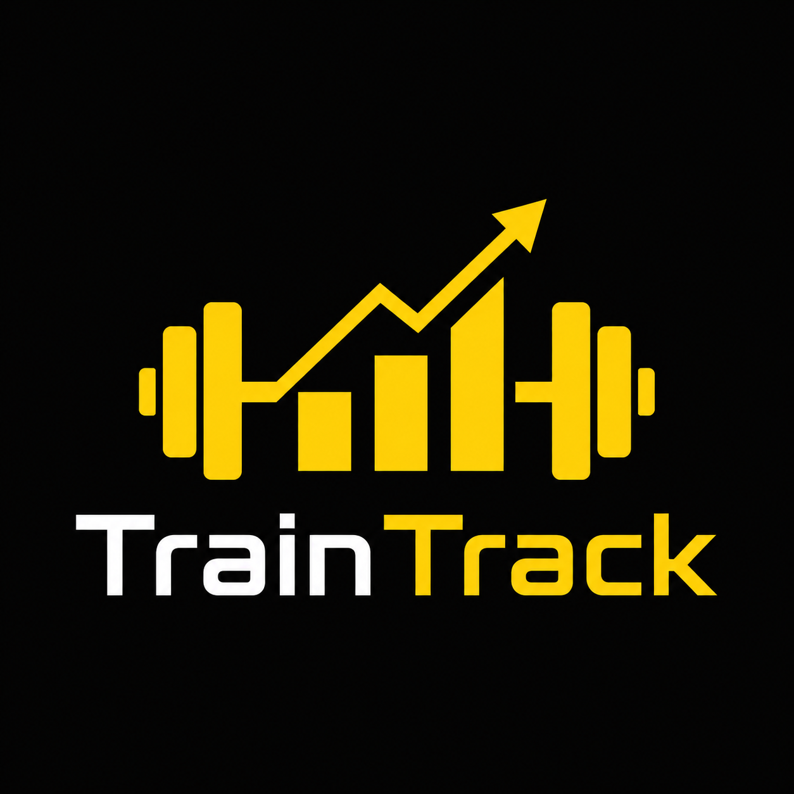

  

  **Modern fitness tracking application for recording workouts, monitoring progress, and staying consistent.**

---

## About the Project

TrainTrack is a web application for recording workouts and monitoring the structure of completed training sessions. Each workout contains multiple exercises with basic parameters such as primary muscle group, number of sets, repetitions and used weight. The application provides an overview of recorded workouts and analyzes muscle group workload in order to highlight possible imbalance in training.

---

## Main Idea

The goal of TrainTrack is to combine a clean workout diary with useful progress tracking.

Instead of relying on memory or scattered notes, users can manage their training data directly in the application and see how their performance develops over time.

---

## Key Features

- Workout and exercise logging
- Tracking of sets, repetitions, and weights
- Training history overview
- Progress monitoring
- Clean and simple user interface
- Focus on consistency and long-term improvement

---

## Vision

TrainTrack aims to be a practical tool for people who want to take their training more seriously, stay organized, and make their progress measurable.